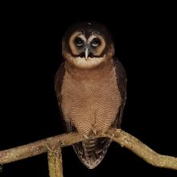
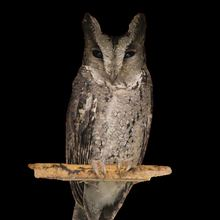
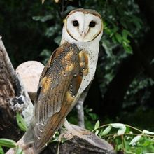
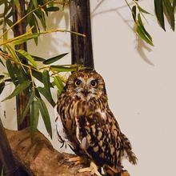

# AR 貓頭鷹互動導覽

> 為國立自然科學博物館・鳳凰谷鳥園生態園區規劃的互動式貓頭鷹導覽原型

[立即體驗網站](https://korykoryko66.github.io/bird/)　｜　[查看原始碼](https://github.com/korykoryko66/bird)

## 專案介紹

「AR 貓頭鷹互動導覽」是一個以手機瀏覽器為主要使用情境的數位導覽專題。專案希望把傳統解說牌上的靜態照片與文字，延伸為包含開場短片、3D 模型、中英雙語物種資料及叫聲的互動體驗。

遊客選擇解說牌照片後，網站會先播放約 5 秒的貓頭鷹開場精華影片，同時在背景載入對應的 GLB 模型。影片結束後，遊客可以拖曳、旋轉及縮放貓頭鷹，並開啟完整物種資料卡或播放叫聲，從不同角度認識牠的外觀與生態。

目前版本是「辨識解說牌後會出現的互動內容」之展示原型，不需要開啟相機權限，因此可直接在電腦、平板或手機瀏覽器中體驗。未來若正式導入園區，可再串接影像辨識工具，讓遊客以手機相機對準實體解說牌後啟動內容。

## 製作動機

一般解說牌能提供可靠的知識，但展示方式多半是靜態的。遊客在園區停留時間有限，也不一定會完整閱讀所有文字。本專題嘗試利用網頁與 3D 技術，讓解說內容具有更清楚的觀看順序：

1. 以短片快速吸引注意並辨識物種。
2. 以可操作的 3D 模型觀察身形、羽色與外觀特徵。
3. 以中英雙語資料卡補充名稱、體型、體重、棲地、外觀及食性。
4. 以叫聲增加聽覺記憶，讓學習不只停留在文字與圖片。

此設計也希望降低使用門檻。遊客不必安裝 App，只要透過支援 WebGL 的瀏覽器開啟網站，就能開始體驗。

## 收錄的貓頭鷹

<table>
  <tr>
    <td align="center"><br><strong>褐林鴞</strong><br>Brown Wood Owl<br><em>Strix leptogrammica</em></td>
    <td align="center"><br><strong>領角鴞</strong><br>Collared Scops Owl<br><em>Otus lettia</em></td>
    <td align="center"><br><strong>倉鴞</strong><br>Barn Owl<br><em>Tyto alba</em></td>
    <td align="center"><br><strong>短耳鴞</strong><br>Short-eared Owl<br><em>Asio flammeus</em></td>
  </tr>
</table>

每個物種都有獨立的照片、解說牌圖片、開場影片、3D 模型、雙語資料及叫聲體驗。模型與檔名已依網站中的物種名稱配對，避免切換物種時載入錯誤素材。

## 主要功能

### 5 秒開場精華影片

進入物種頁面後先播放短片，讓遊客快速建立對該物種的第一印象。影片播放期間會同步下載 3D 模型，減少遊客直接面對空白載入畫面的時間；如果不想等待，也可以按下「略過影片」。

### 3D 模型自由探索

- 使用滑鼠或單指拖曳旋轉模型。
- 使用滑鼠滾輪或雙指手勢縮放模型。
- 使用畫面上的 `＋`、`－` 與 `100%` 按鈕調整或重設大小。
- 不同來源的模型會自動置中並縮放至適合的顯示比例。

### 中英雙語物種資料卡

資料卡包含以下內容：

- 中英文名稱與學名
- 基本介紹
- 體型與體重
- 分布範圍及居住環境
- 外觀型態
- 食性
- 延伸資料來源

雙語設計除了服務本地遊客，也能讓外國遊客了解園區展示的物種。

### 貓頭鷹叫聲

每個物種都有可操作的叫聲按鈕，透過聽覺協助遊客建立物種印象。現階段部分聲音屬於程式合成示意，若正式公開使用，應替換成經過授權並由館方確認的真實錄音。

### 響應式操作介面

版面會配合手機、平板與桌面螢幕調整。模型區域、按鈕、資料卡與文字大小均針對觸控操作設計，讓不同尺寸的裝置都能使用。

## 遊客體驗流程

```text
選擇貓頭鷹解說牌
        ↓
顯示辨識動畫與物種名稱
        ↓
播放 5 秒開場影片，同步載入模型
        ↓
自由旋轉與縮放 3D 貓頭鷹
        ↓
閱讀中英雙語物種資料卡
        ↓
播放叫聲，或返回選擇其他物種
```

整個流程以「先吸引注意、再自由探索、最後補充知識」為核心，讓不同年齡與閱讀習慣的遊客都能找到適合自己的體驗方式。

## 教育與展示價值

- **提高停留意願：** 短片與 3D 模型比單純文字更容易吸引遊客開始探索。
- **加深外觀記憶：** 遊客可以自行調整模型角度，觀察正面、側面及背面特徵。
- **整合多感官學習：** 同時使用影像、立體模型、文字與聲音傳遞資訊。
- **支援雙語導覽：** 讓本地與國際遊客都能閱讀主要物種資訊。
- **方便內容擴充：** 日後可加入其他鳥類、新語言、知識問答或探索紀錄。
- **不需安裝 App：** 透過網址或 QR Code 即可進入，降低園區部署與遊客使用門檻。

## 使用技術

| 技術 | 用途 |
| --- | --- |
| HTML5 | 建立頁面結構與可操作元件 |
| CSS3 | 響應式排版、動畫與視覺設計 |
| JavaScript | 畫面切換、資料卡、影片、叫聲與互動控制 |
| Three.js | 建立 WebGL 3D 場景、相機、燈光與模型控制 |
| GLTFLoader | 載入 GLB 格式的貓頭鷹模型 |
| MP4 | 播放四種貓頭鷹的開場影片 |
| GitHub Pages | 提供免伺服器的靜態網站部署 |
| jsDelivr CDN | 加速正式網站的大型影片與模型資源傳送 |

網站不使用前端框架或建置工具，下載專案後即可閱讀原始碼，也適合用於教學與展示。

## 效能處理

3D 模型與影片是本專案最大的檔案，因此網站針對載入體驗做了以下處理：

- 正式網站透過 jsDelivr CDN 讀取模型與影片，本機預覽則直接使用資料夾內的檔案。
- 播放開場影片時同步載入模型，利用觀看影片的時間進行下載。
- 顯示模型下載進度，避免遊客誤以為網站沒有反應。
- CDN 失敗時嘗試載入 GitHub Pages 上的本地備用模型。
- 模型約控制在 10 萬三角面等級，在外觀細節與手機效能間取得平衡。
- 提供略過影片與縮放控制，讓遊客能依裝置和網路狀況調整操作。

實際速度仍會受到手機效能、網路品質、瀏覽器快取與 GitHub／CDN 節點狀態影響。

## 專案結構

```text
bird/
├─ index.html          # 網站畫面結構
├─ style.css           # 版面、動畫與響應式樣式
├─ script.js           # 物種資料、3D 場景與互動邏輯
├─ 褐林鴞.glb          # 褐林鴞 3D 模型
├─ 領⾓鴞.glb          # 領角鴞 3D 模型
├─ 倉鴞.glb            # 倉鴞 3D 模型
├─ 短耳鴞.glb          # 短耳鴞 3D 模型
├─ img/
│  ├─ photo_1.jpg     # 首頁物種照片
│  ├─ photo_2.jpg
│  ├─ photo_3.jpg
│  ├─ photo_4.jpg
│  └─ poster_*.jpg    # 解說牌／辨識動畫圖片
├─ movie/
│  ├─ 褐林鴞.mp4      # 開場影片
│  ├─ 領⾓鴞.mp4
│  ├─ 倉鴞.mp4
│  └─ 短耳鴞.mp4
└─ vendor/
   └─ GLTFLoader.js   # Three.js GLB 載入器
```

> `領⾓鴞` 的檔名包含特殊字形。若要重新命名模型或影片，必須同步修改 `script.js` 中的素材路徑，否則網站會找不到檔案。

## 本機預覽

為避免瀏覽器對本機檔案的安全限制，建議使用本機 HTTP 伺服器，不要只用滑鼠雙擊 `index.html`。

如果電腦已安裝 Python，可在專案資料夾執行：

```bash
python -m http.server 8765
```

接著開啟：

```text
http://127.0.0.1:8765/
```

本機預覽時，網站會從目前資料夾讀取 GLB 與 MP4；部署到 GitHub Pages 後，則會優先使用設定好的 CDN 路徑。

## 建議使用環境

- 最新版 Google Chrome、Microsoft Edge、Safari 或 Firefox
- 支援 WebGL 的手機、平板或電腦
- 穩定的 Wi-Fi 或行動網路
- 手機建議使用直向畫面體驗

部分較舊裝置可能因記憶體或 GPU 效能不足，出現模型載入較慢、動畫掉幀或頁面重新整理等情況。

## 目前限制

1. **尚未整合正式相機辨識：** 目前以點選解說牌照片模擬辨識後的導覽流程，不會要求相機權限。
2. **AI 生成模型仍可能有誤差：** 背面羽毛、腳爪、角羽及身體比例可能與真實物種不同。
3. **AI 影片需要人工審核：** 生成影片可能出現羽色、臉盤、眼睛或身形不符合物種的情況。
4. **聲音仍有示意內容：** 正式版本應使用有合法授權的真實物種叫聲。
5. **大型資源需要下載時間：** 網路較慢時，影片與模型可能無法立即顯示。
6. **生物資訊需要專業確認：** 網站資料在正式對外展示前，仍應由鳥園或相關領域專家校對。

## 未來發展

- 導入 MindAR 或其他 WebAR 影像辨識技術，讓手機直接辨識實體解說牌。
- 使用品質更高的多角度照片與 3D 生成工具，修正模型背面及羽毛細節。
- 使用 Seedance 2.5 等影片生成工具改善物種外觀、動作與畫面一致性。
- 將影片、模型與圖片進一步壓縮，並依裝置提供不同精細度版本。
- 加入真人或 AI 語音導覽、字幕、鍵盤操作及螢幕閱讀器支援。
- 擴充日文、韓文或其他語言。
- 加入探索護照、知識問答、收集印章與完成紀錄。
- 建立館方內容管理方式，讓工作人員可更新文字、素材與物種資料。

## 資料與素材說明

網站中的物種基本資料卡附有延伸參考連結，主要用來支援專題展示與後續查證。正式提供給遊客前，應由館方確認名稱、分類、體型、棲地、食性及個體故事等內容是否符合最新資料。

本專案包含照片、解說牌圖片、影片、叫聲及 AI 輔助生成的 3D 模型。任何素材在正式公開、展示、再製或商業使用前，都應再次確認來源、授權範圍、標示方式與使用期限。GitHub 儲存庫公開並不代表其中所有媒體素材自動成為自由授權素材。

## 專案狀態與免責聲明

本網站目前為學生專題及互動導覽概念原型，用於展示設計方向與技術可行性；並非國立自然科學博物館或鳳凰谷鳥園生態園區已正式發布的官方服務。

後續若要在園區正式部署，建議進行以下工作：

- 館方審核全部物種資訊與個體故事。
- 逐一確認照片、影片、音效與模型的使用授權。
- 進行不同手機、瀏覽器與園區網路環境測試。
- 補充隱私權、資料使用及相機權限說明。
- 由實際遊客參與操作測試，再依回饋調整介面。

---

**專題名稱：** 鳳凰谷鳥園 AR 貓頭鷹互動導覽  
**線上網站：** <https://korykoryko66.github.io/bird/>  
**GitHub：** <https://github.com/korykoryko66/bird>
